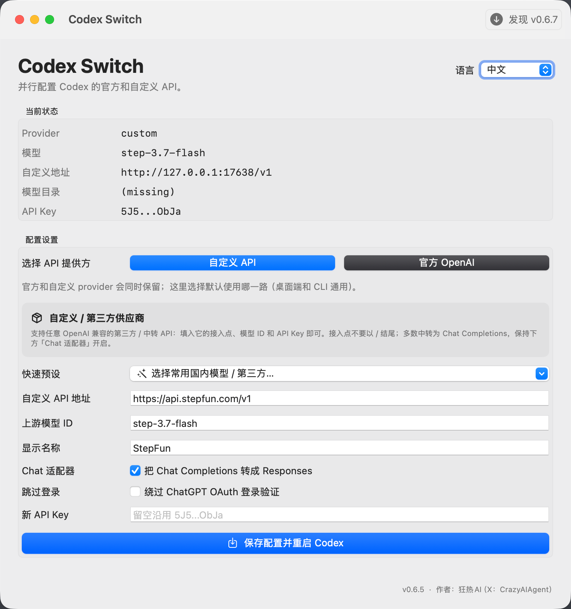

# Codex Switch

> 一个小巧的 macOS 工具：一键把 Codex 在「官方 OpenAI」和「你自己的自定义 / 第三方 API」之间切换，**切换后对话记录始终都在**。

Codex Switch 把原本要手改 `~/.codex/auth.json` 和 `~/.codex/config.toml` 的事变成一次点击：官方 OpenAI 和你的自定义 provider 同时保留在配置里，切换只改「默认走哪一路」，不会重写已保存对话的 provider/model 归属。内置国内主流大模型快速预设，并能在本地启动适配器把只支持 Chat Completions 的接口桥接成 Codex 需要的 Responses 协议。

> ⚠️ 不要在对话里让 Codex 自己改接入方式，容易改坏。切换请用本工具，稳定得多。

<p align="center">
  
</p>

## 下载

从 [GitHub Releases](https://github.com/kuangre123/codex-switch/releases/latest) 下载，**推荐 DMG**：

```text
Codex-Switch-vX.Y.Z.dmg        # 推荐：已签名 + 公证，双击即开
Codex-Switch-vX.Y.Z-macOS.zip
```

应用已用 **Developer ID 签名并通过 Apple 公证**，且为 **通用二进制（Intel + Apple 芯片）**。打开 DMG 把 `Codex Switch.app` 拖进「应用程序」即可，不会再有"未受信任的开发者"提示。

## 功能

- **官方 / 自定义并行**：两套配置都留在 `config.toml`，在 App 里选「API 提供方」再保存即可切换（桌面端和 CLI 通用）。
- **对话永不丢**：正常切换只改写 `config.toml` 和 `auth.json`；若检测到旧版适配器留下的非法 message ID，则先备份、再一次性修复 ID 前缀，历史内容与会话归属保持不变。
- **国内大模型快速预设**：DeepSeek、Kimi、智谱 GLM、通义千问、豆包（火山引擎）、百度文心、MiniMax、阶跃星辰 StepFun，以及「第三方 / 中转 API（手动填写）」——选完自动填好接入点和模型，只需粘贴 Key。
- **自定义 / 第三方供应商卡片**：支持任意 OpenAI 兼容的第三方 / 中转 API。
- **Chat 适配器**：接口只支持 `/chat/completions` 时，本地起代理自动把 Responses 转成 Chat Completions；原生 `/responses` 则直连。
- **保存时智能探测**：保存前先试探接入点（先 `/responses` 再 `/chat/completions`），都不通就报错「请检查设置」。
- **跳过登录**：可选绕过 ChatGPT OAuth，用 API‑Key 模式。
- **CLI 通用**：写入 `[profiles.ccswitch]`（自定义）和 `[profiles.official]`（官方），终端 `codex` / `codex-official` 直接用。

## 切换原理

借鉴 [cc-switch](https://github.com/farion1231/cc-switch)：provider 切换工具只写实时配置文件，绝不动会话数据。

- 自定义 API → 顶层 `model_provider = "custom"`。
- 官方 OpenAI → 顶层 `model_provider = "openai"`，用 Codex 内置完整模型目录。
- 两个 provider 段 + CLI profiles 始终保留；**不写自定义模型目录**（会替换内置目录、易导致对话列表加载失败，已移除）。

> 桌面端模型选择器由 Codex 自己驱动；自定义模型显示为"自定义"标签是 Codex 的限制，但请求会正确路由，CLI 可完全控制模型 ID。

## CLI

```bash
codex-switch status

codex-switch configure \
  --base-url https://api.deepseek.com/v1 \
  --custom-model deepseek-chat \
  --custom-model-name "DeepSeek" \
  --official-model gpt-5.5 \
  --default-provider custom \
  --chat-adapter --probe --restart-codex
```

## 会改动哪些文件

```text
~/.codex/auth.json
~/.codex/config.toml
~/.codex/codex-switch-state.json
~/.codex/codex-switch-adapter.py
```

不会改写会话数据库或会话内容。仅在检测到旧版适配器生成的 `item_...` message ID 时修复为协议要求的 `msg_...`，原文件备份在 `~/.codex/backups_state/message-id-repair/`。

## 作者

狂热AI（X：[@CrazyAIAgent](https://x.com/CrazyAIAgent)）
